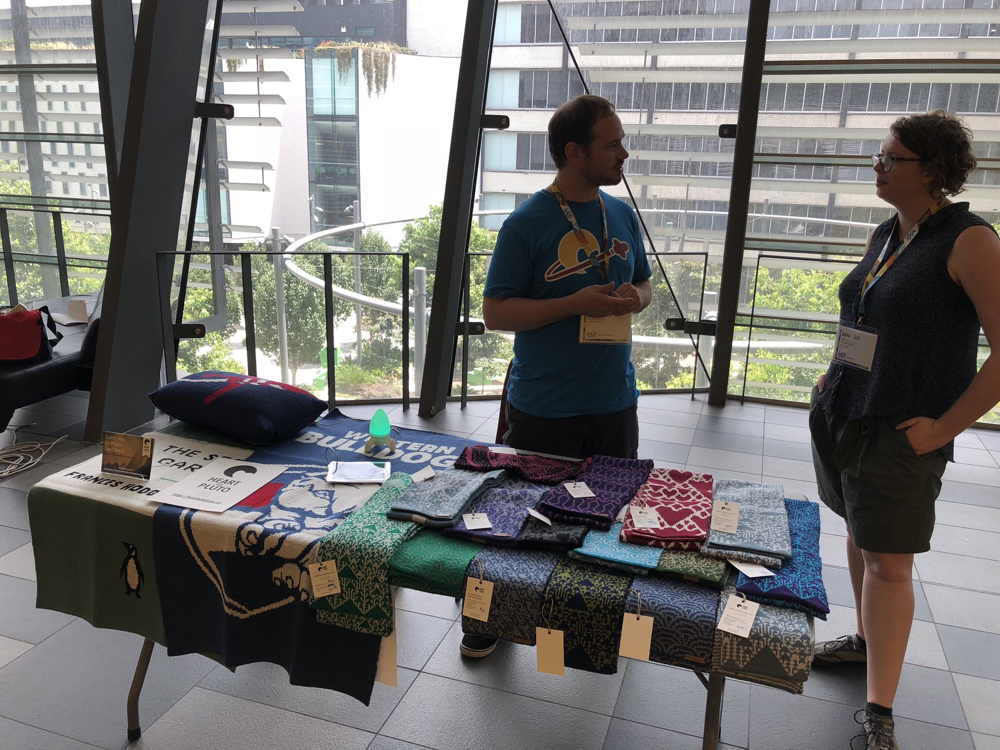
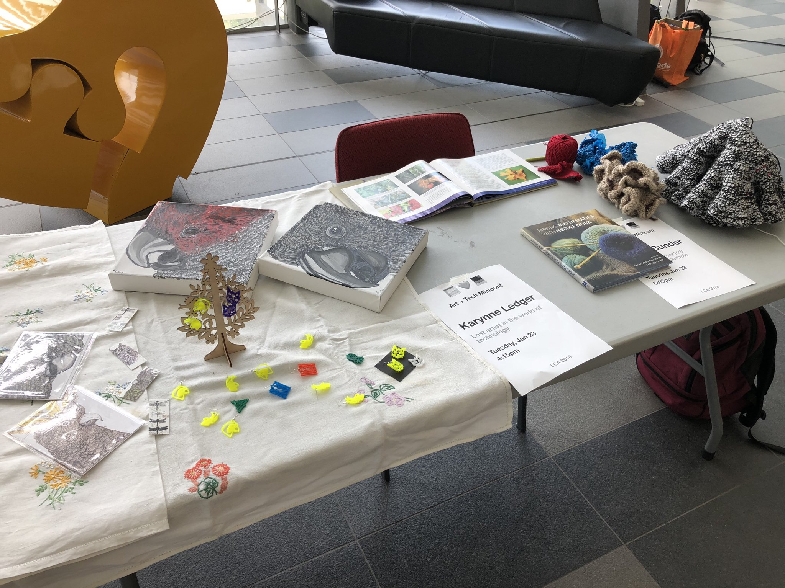
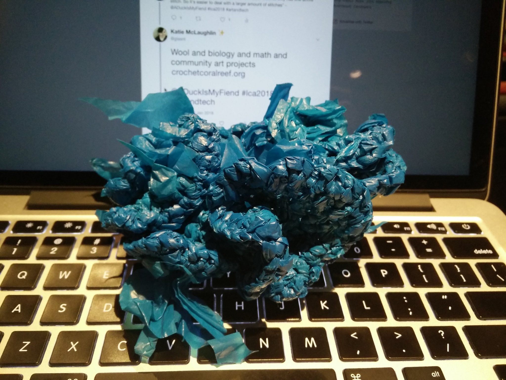
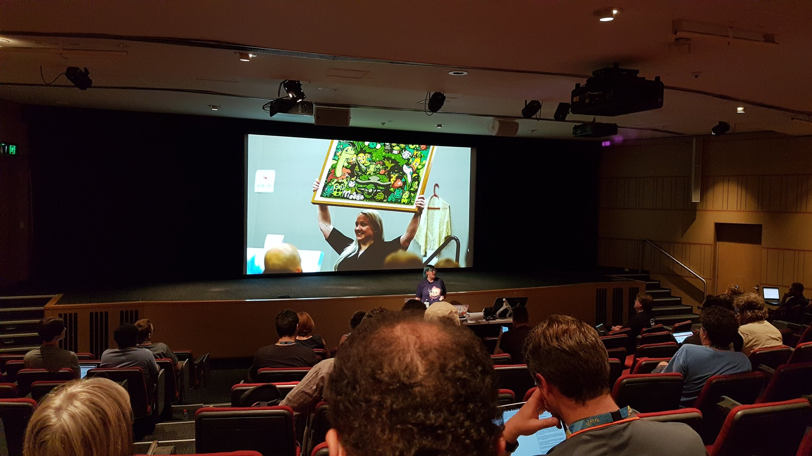

🖼❤️💻

For years, [Linux.conf.au](https://linux.conf.au/), a week long conference, has held space for more niche groups of the tech community to share their inventions and ideas in dedicated 'miniconfs'. In 2018, the Art and Tech miniconf took this tradition to the next level, by having an entire day of 11 talks about making art with tech, and holding an art exhibit showing the speakers' work to the conference at large. This miniconf was organised by Blue Ribbon Award winning knitter [Kris Howard](https://twitter.com/web_goddess).

## Disclaimer

Some of the links in this article contains mature content. As articulated by Kathy Reid, Linux Australia President: "Significant art is often contentious, because it challenges who we are and the notions we hold of ourselves. Our job here is to allow that art to be shown, while creating a safe environment for those who do - and do not - wish to view it."

## Exhibition

While the miniconf was held on Tuesday, the second day of the conference, a number of speakers were able to exhibit their work in the conference venue during the Monday lunch break. This allowed attendees from around the conference to see the art on display and drive interest to see the talks on the Tuesday

*Machine printed knitting in Double Jacquard style, by Sarah Spencer. Photo Kris Howard, CC-BY*

*Various art pieces, including 3D-printed earrings by Karynne Ledger, and crochet coral by Rachel Bunder. Photo Kris Howard, CC-BY*

## The Future of Art

Opening proceedings was [J. Rosenbaum](https://twitter.com/minxdragon), who immediately informed the audience that ["Robots are not our overlords, they are our new best friends".](https://twitter.com/deponentVMB/status/956677536640991232). What followed was a showcase of works by herself and others, ranging from cute and interesting, to borderline disurbing. Some more consumable examples were the works from [Botnik](http://botnik.org/), the minds behind the recently viral [Harry Potter and the Portrait of what looked like a Large Pile of Ash](http://botnik.org/content/harry-potter.html). The entire talk is one to be absorbed and reflected on. 

## If I were a pixel, what would I do?

Giving an overview of the complex world of shaders, [Harley Mellifont](https://twitter.com/metaeaux) was able to show off the power of the [OpenGL Shading Language (GLSL)](https://en.wikipedia.org/wiki/OpenGL_Shading_Language) in his talk [If I were a pixel, what would I do?](https://www.youtube.com/watch?v=NyiCoRZTYS8). He also referenced a tutorial on [shaders](https://www.youtube.com/watch?v=s8nFqwOho-s&feature=youtu.be) that will 'blow your mind'.

## On Writing Machines

In a talk near and dear to my heart, [Mark Rickerby](https://twitter.com/maetl) spoke on [Writing Machines](https://www.youtube.com/watch?v=42DNv2lpPr0) and their history, starting from the 1840's through to today's twitter bot Markov chains. He also included a short summary of the interesting issues when considering how to get machines to compose English in a natural way, which was also a [lightning talk](https://www.youtube.com/watch?v=brNmfD1Lb7M&t=3455) from lca2017, by [Roan Kattouw](https://twitter.com/catrope)

## Building Detailed Fractal Sets for "Guardians of the Galaxy Vol. 2"

In a talk where you just *had* to be there (because it was not recorded due to the copious amounts of Marvel content), [Miles Green](https://www.imdb.com/name/nm2908608/) shared with us a story of all the work that went behind the scenes to create the fractal set design from Ego's Garden and Ego's Palace in Guardians of the Galaxy Vol 2. It was a very interesting look at all the work [AnimalLogic](https://www.animallogic.com/) put into making just a small bit of the background scenery for an already beautifully rich movie.  

## The Knitting Printer

In a talk that I had an increasingly hard time not audibly squee'ing throughout, [Sarah Spencer](https://twitter.com/HeartOfPluto_) shared her process in making a [network connected knitting printer](https://www.youtube.com/watch?v=Y6k15pdFTsA), highlighting the [AYAB](http://ayab-knitting.com/) and [Electoknit](https://learn.adafruit.com/electroknit/overview) projects. She's released a number of projects relating to her workflow on her [GitHub account](https://github.com/chixor) including [octoknit](https://github.com/chixor/octoknit), an interface to upload patterns to a Brother 950i knitting machine; and [binary-to-image](https://github.com/chixor/binary-to-image), which takes text and outputs it as an image, which would allow you to do things such as knit your favourite lyrics into a scarf! 

## Sketching in hardware

In his talk, [Christopher Biggs](https://twitter.com/unixbigot) showed us how he practices iterative design by literally [sketching in hardware](https://www.youtube.com/watch?v=zz2vGhI9x20). He talks of some of his side projects, and the iterative development process afforded by cheap 3D printing mock designs, a technique he picked up from [Naomi Wu](https://twitter.com/RealSexyCyborg) 

## Lost artist in the world of technology 

Following a line-up of developers, [Karynne Ledger](https://twitter.com/currawongwhsper), a chef and artist, showed us how she used technology to [augment her artwork](https://www.youtube.com/watch?v=IHEYGb8mKYM). One of her side points had a real impact to me: she lamented how she wasn't able to easily pick up certain tech products, while her more technically inclined friends assured her it was 'easy'. This spoke to me as we should be ensuring that the things we can create can be easily accessed and used by those with all levels of technical aptitude, instead of keeping things to our own kind. 

## Hobbyist lightning lighting projects

Hacker and maker and sometimes developer [Peter Hardy](https://twitter.com/stibbons) shared his various [lightning projects](https://www.youtube.com/watch?v=R7LyG00MQLM) including his physical Kerbel Space Program console, with big red buttons and LED displays, and a sound activated liqour cabinet.

In his talk he also demonstrated [iCircuit](http://icircuitapp.com/), an app which allows you to test circuit diagrams without the chance of LEDs 'shining very brightly, very briefly'. 

## Crochet the coral reef

[Rachel Bunder](https://twitter.com/ADuckIsMyFiend) describes in her possibly over-sold talk title [The best talk ever1!!!!! Hyperbolic Hyperbole](https://www.youtube.com/watch?v=l31HdQbuWb4) about the crochet coral reef project, and the mathematical complexities of the multi-dimensional art that is wool work. 

*Crocheted plastic bags in a hyperbolic form, bearing similarity to a coral reef. Piece by Rachel Bundler, Photo by Katie McLaughlin, CC-BY*

##  Balsa

In a talk prefaced with "This is why you don't need to buy a 3D printer", [Dr Josh Deprez](https://twitter.com/DrJosh9000) showed us his [mini mac](https://www.youtube.com/watch?v=YsvNtf90ZBk), made with an enclosure made of balsa wood. He also spoke on the iterability of such a development material; balsa wood being a very light weight wood, readily available in craft stores. 

## Cross-stitching

Rounding out the day was [my own talk](https://twitter.com/glasnt), wherein I spoke about the process I went through to finally make [cross-stitch generation software](https://www.youtube.com/watch?v=vwzMniTNK2Q). In the first lightning talk I ever gave back in 2014, I accidentially promised that I would make open source cross-stitching software. Four years later, I've released [626](https://github.com/glasnt/626), a Python-based HTML generator does does just that. I also released a [qr code chart generator](http://glasnt.com/qr), which takes a string and gives you a cross stitch chart, an idea that I [tweeted about](https://twitter.com/glasnt/status/947992331323547648) earlier in the month, that people were quite excited to have be a thing.

*A photo from the audience during the final talk of the Art and Tech miniconf. Photo by [SuperRoach](https://twitter.com/SuperRoach), CC BY-NC-SA 2.0*

---

An entire playlist of the talks from this miniconf is available on [Youtube](https://www.youtube.com/playlist?list=PLAObS6o1v0zKRBoEwPD6YreMfGFvh6zdM)

Linux.conf.au will return in 2019 in Christchurch, New Zealand on January 21 - 25 2019. Details about this event will be posted throughout the year on [linux.conf.au](https://linux.conf.au) 
