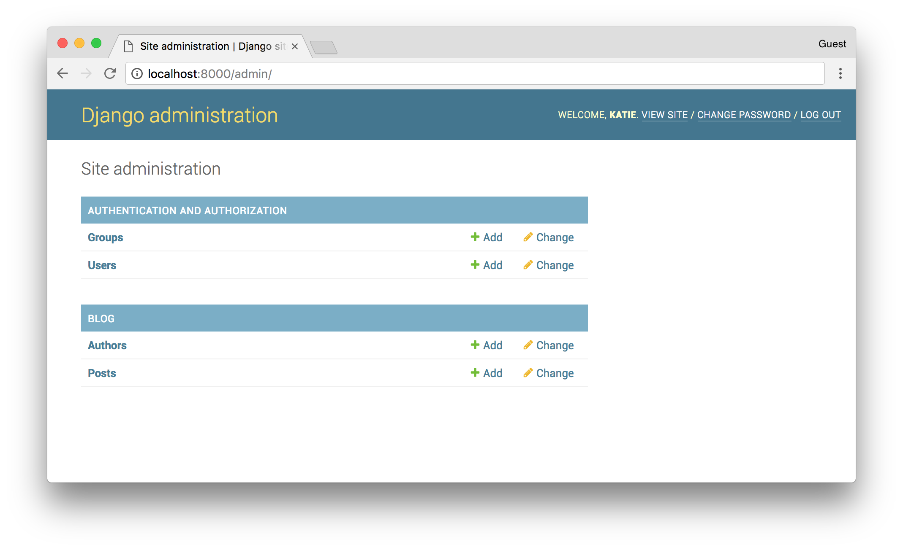
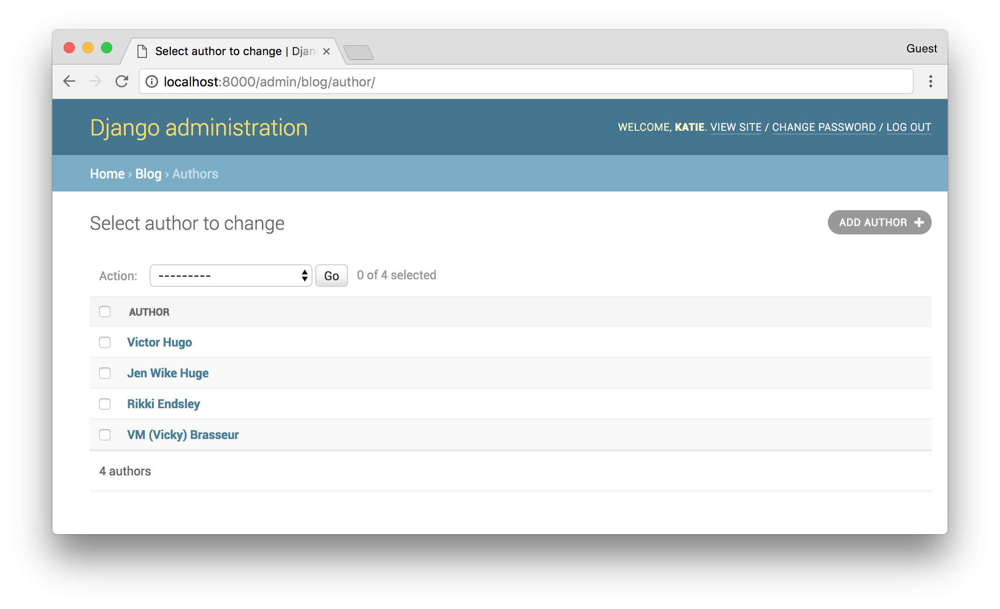

## Getting to know the Django ORM

You might have heard of [Django](https://www.djangoproject.com/) before, the Python web framework for "perfectionists with deadlines". It's that one with the [cute pony](http://www.djangopony.com/). 

One of the most powerful features of Django is it's Object Relational Model, or the **ORM**. It's the way you can interact with your database, like you would with SQL. In fact, the ORM is just a pythonical way to create SQL to query and manipulate your database, and get results in a pythonic fashion. Well, I say __just__ but it's actually some really clever engineering that takes advantage of some of the more complex parts of Python to make developers' lives easier. 

Before we start looking into how the ORM works, we need a database to manipulate. As with any relational database, we need to define a bunch of tables and their relationships: the way they relate to each other. Let's use something familiar: say we want to model a blog that has blog posts, and authors. An author has a name. An author can have many blog posts. A blog post can have many authors, and has a title, content, and a published date. 

In Django-ville, this concept of posts and authors could be called our Blog app. In this context, an **app** is a self-contained set of models, views and controllers that describes the behaviour and functionality of our blog. Packaged in the right way, many Django projects could use our Blog app. In our project, the Blog could just be one app. We might also have a Forum app, for example. But we'll stick with the scope of our Blog app. 

Here's a `models.py` we prepared earlier: 

```python
from django.db import models

class Author(models.Model):
    name = models.CharField(max_length=100)

    def __str__(self):
        return self.name

class Post(models.Model):
    title = models.CharField(max_length=100)
    content = models.TextField()
    published_date = models.DateTimeField(blank=True, null=True)
    author = models.ManyToManyField(Author, related_name="posts")

    def __str__(self):
        return self.title
```

Now, this might look a bit daunting, so let's break it down. We have two models: Author and Post. Each of those has a name or title. The post has a big text field for content, and a DateTimeField for the datetime. Post also has a `ManyToManyField`, which links Posts and Authors together.  

We're going to jump ahead and assume that you have a running application using this model that already has content. It's now your task to go into the application and take a look around. There are a few ways to do this. You could login to the **django admin**, a web-based backend that has all the apps listed, and ways to manipulate them. We'll get back to that. We're interested in the ORM. 

We can access the ORM by running `python manage.py shell` from the main directory of our Django project

```shell
/srv/web/django/ $ python manage.py shell

Python 3.6.3 (default, Nov  9 2017, 15:58:30)
[GCC 4.2.1 Compatible Apple LLVM 9.0.0 (clang-900.0.38)] on darwin
Type "help", "copyright", "credits" or "license" for more information.
(InteractiveConsole)
>>>
```

This will bring us into an interactive console. The [`shell` command](https://docs.djangoproject.com/en/1.11/ref/django-admin/#shell) did a lot of setup for us, including importing our settings and starting Django. While we've launched the shell, we can't access the Blog model we have until we import it. 

```python
>>> from blog.models import *
```

This imports all the blog models, so we can play with our blog posts, and authors. 

For starters, let's get a list of all the Authors
```python
>>> Author.objects.all()
```

What we'll get from this command is a list of all the Authors in a representative string. We also won't fill our entire console, because if there are a lot of results, django will automatically truncate the printed results. 

```python
>>> Author.objects.all()
<QuerySet [<Author: VM (Vicky) Brasseur>, <Author: Rikki Endsley>, <Author: Jen Wike Huger>, '...(remaining elements truncated)...']
```

We can select a single author using `get` instead of `all`. But we need a bit more information to `get` a single record. In relational databases, tables have a primary key field which a unique identifer for each and every record in a table. However, author names are not unique. Many people may [share the same name](https://2016.katieconf.xyz/), so it's not a good unique constraint. A way to get around this is to have a __Sequence__ (1, 2, 3...) or a __Universal Unique Identifer (UUID)__ as the primary key. But since these aren't nicely useable by humans, we can manipulate our author objects by using name. 

```python
>>> Author.objects.get(name="VM (Vicky) Brasseur")
<Author: VM (Vicky) Brasseur>
```

This time, we have a single object that we can interact with, instead of a QuerySet list. With this object, we can interact with it pythonically, using any of the table columns as attributes to look at the object.

```python
>>> vmb = Author.objects.get(name="VM (Vicky) Brasseur")
>>> vmb.name
u'VM (Vicky) Brasseur'
```

And this is where the cool stuff happens. Normally in relational databases, if we want to show information for other tables we'd need to write `LEFT JOIN`s or other table coupling functions, making sure that our foreign keys match up between tables. Django takes care of that for us. 

So in our model, authors write many posts. So, with our Author object, we can just check what posts they've made. 

```python
>>> vmb.posts
QuerySet[<Post: "7 tips for nailing your job interview">, <Post: "5 tips for getting the biggest bang for your cover letter buck">, <Post: "Quit making these 10 common resume mistakes">, '...(remaining elements truncated)...']
```

We can manipulate QuerySets using normal pythonic list manipulations

```python
>>> for post in vmb.posts:
...   print(post.title)
7 tips for nailing your job interview
5 tips for getting the biggest bang for your cover letter buck
Quit making these 10 common resume mistakes
```

If we want to do more complex querying, we can use filters instead of just getting everything. Here is where it gets tricky. In SQL, you have options like `like`, `contains`, and other filtering objects. You can do all these things in the ORM, too, but it has a special way of doing them: by using implictly (rather than explicitly) defined functions. 

If I call a function `do_thing()` in my Python script, I'd expect there somewhere there would be a matching `def do_thing`. This is an explicit functionl definition. However in the ORM, you can call a function that __isn't explicitly defined__. Before we were using `name` to match on a name. But, if we wanted to do a substring search, we can use `name__contains`. 

```python
>>> Author.objects.filter(name__contains="Vic")
QuerySet[<Author: VM (Vicky) Brasseur>, <Author: Victor Hugo">]
```

Now, a small note about the double underscore (`__`). These are __very__ python. You may have seen `__main__` or `__repr__` in your travels in Pythonland. These are sometimes referred to as **dunder methods**, a shortening of "**d**ouble **under**score". There are only a few non-alphanumeric characters that can be used in object names in Python; underscore is one of them. So, in the ORM these are used as an explicit separator of different parts of the filter key name. Under the hood the string is split by these underscores, and the tokens are processed separately. `name__contains` gets changed into `attribute: name, filter: contains`. In other programming languages you may use arrows instead, such as `name->contains` in PHP. Don't let dunders scare you, they're just pythonic helpers! (And if you squit, you could say they look like little snakes, little pythons that want to help you with your code.)

The ORM is extremely powerful and very pythonic. But what about that Django Admin you might have heard about?


 
One of the brilliant user accessibility features of Django is its Admin. If you define your models, you get a nice web-based editing portal, for free. 

And what powers this? **The ORM**



That's right! Given the code used to create the original models, Django turned that into a web-based portal, which is powered using the same raw functions we used earlier. By default, the admin is basic, but it's just a matter of adding more definitions in your model to change how the admin looks. For example, those `__str__` methods earlier? We use those to define what an Author object looks like (in this case, just the name of the author). With a bit of work, you can make an interface that feels like a full content management system that allows your users to edit their own content with ease (for example, adding fields and filters for marking a post as "Published")


If you'd like to know more, the [djangogirls tutorial](https://djangogirls.org) section on [the ORM](https://tutorial.djangogirls.org/en/django_orm/) has a detailed walk through. There's also copious amounts of documentation on the [djangoproject website](https://docs.djangoproject.com/en/1.11/topics/db/)
