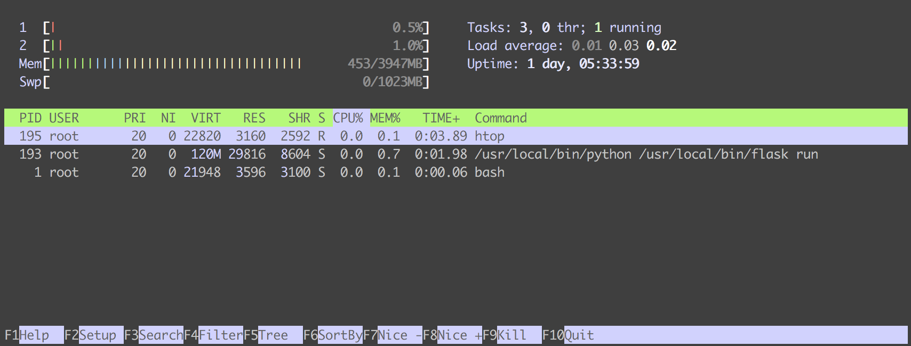

Trying to find out what's running on your machine, and which process is using up all your memory and making things slllooowwww, is an task served well by the utility `top`. 

`top` is an extremely useful program that acts not unlike Windows Task Manager, or macOS's Activity Monitor.

Running `top` on your \*nix machine will show you a live running view of the process running on your system.

```shell
$ top
```

Depending on which version of `top` you're running, you'll get something that looks like this: 

```
top - 08:31:32 up 1 day,  4:09,  0 users,  load average: 0.20, 0.12, 0.10
Tasks:   3 total,   1 running,   2 sleeping,   0 stopped,   0 zombie
%Cpu(s):  0.5 us,  0.3 sy,  0.0 ni, 99.2 id,  0.0 wa,  0.0 hi,  0.0 si,  0.0 st
KiB Mem:   4042284 total,  2523744 used,  1518540 free,   263776 buffers
KiB Swap:  1048572 total,        0 used,  1048572 free.  1804264 cached Mem

  PID USER      PR  NI    VIRT    RES    SHR S  %CPU %MEM     TIME+ COMMAND
    1 root      20   0   21964   3632   3124 S   0.0  0.1   0:00.23 bash
  193 root      20   0  123520  29636   8640 S   0.0  0.7   0:00.58 flask
  195 root      20   0   23608   2724   2400 R   0.0  0.1   0:00.21 top
```

_Your version of `top` may differ from this, particularly in the columns that are displayed._

## How to read the output

We can tell what we're running based on this output, but trying to interpret the output can be slightly confusing. 


At the top we can see a bunch of statistics, and then we can see a list of things. 

### The list

These are the *processes* that are running on the system which are ordered, by default, by CPU usage, in descending order. 

Literally, the top processes by resource usage. You have to admit, it's a clever name. 

The `COMMAND` column tells us the name of the process (the command that was run to start them). In our case: we have `bash` (a command interpreter that we're running `top` in), `flask` (a web micro-framework written in Python), and `top` itself.

The columns we're seeing are useful information about the processes from the column headers: 
 - `PID`: the *process id* - a unique identifier for addressing the processes
 - `USER`: the user that is running the process
 - `PR`: the priority of the task
 - `NI`: a nicer representation of the priority
 - `VIRT`: Virtual Memory Size in KiB (kibibytes)\*
 - `RES`: Resident Memory Size in KiB (kibibytes)\* - the "physical memory", a subset of VIRT
 - `SHR`: Shared Memory Size in KiB (kibibytes)\* - the "shared memory", a subset of VIRT
 - `S`: Process State - one of: "I"dle, "R"unning, "S"leeping, "Z"ombie, Stopped ("T" or "t"), and other some less common options.
 - `%CPU`: Percentage of CPU Usage since the last screen update
 - `%MEM`: Percentage of Memory Usage (RES) since the last screen update
 - `TIME+`: Total CPU time used since the process started. 
 - `COMMAND`: the command

A few notes on `VIRT`, `RES`, and `SHR`: 

The exact mappings of what these three values represent is something which in everyday operations doesn't *really* matter. The most imporatnt thing is that the process with the most `VIRT` the process using the most memory. If you're in `top` because you're debugging why your computer feels like it's in a pool of molasses, the process with the biggest VIRT number is the culprit. If you would like to learn exactly what the "shared" and "physical" memory refers to, check out the "Linux Memory Types" of the [`top` manual](http://man7.org/linux/man-pages/man1/top.1.html)

(And yes, I did type ki*bi*bytes, not ki*lo*bytes. The 1024 value that you normally refer to as a kilobyte is *actually* a kibibyte. The Greek *kilo* ("χίλιοι") means *thousand*, and is used to mean 1,000 of something (a kilometer -- a thousand meters, a kilogram -- a thousand grams). Kibi is a portmanteau of *kilo* and *byte*, and means 1024 bytes (or 2 to the power of 10, 2^10). But, because words are hard to say, many people say *kiloybyte* when they mean 1024 bytes. All of this to say that `top` is trying to use the proper terms here, so just go with it. #themoreyouknow)

A note on screen updates: 

One of the objectionably __really cool things__ that linux programs can do is update their own display in a window so that they are updated live, and appear animated. In our case, the time between updates is important, because some of our statistics (`%CPU`, `%MEM`) are based on the value since the last screen update. 

Because we're running in a persistent application, we can press key commands to exact various settings or configuration changes live (instead of, say, closing the application and running the application again with a different command-line flag.) 

Typing `h` invokes the *help* screen, which also shows the default _delay_ (the time between screen updates). By default this value is (probably) 3 seconds, but you can change this by typing `d` (presumably for "delay") or `s` (probably for "screen" or "seconds"). 


### The details

In addition to the list of processes and their details, there's a whole bunch more useful information. Again, some of these may look strange and confusing, but once you take some time to step through each item, they're very useful stats to pull up in a pinch.

The first row: general system information

 - `top`: We're running `top`! Hi `top`!
 - `XX:YY:XX`: this is the time. It updates every time the screen updates. 
 - `up` (then `X day, YY:ZZ`): The [uptime](https://en.wikipedia.org/wiki/Uptime) of the system (the time since the system turned on)
 - `load average` (then three numbers): The [system load](https://en.wikipedia.org/wiki/Load_(computing)) of over the last 1, 5, and 15 minutes, respectively

The second row shows task information, and it's fairly self explanatory: it shows the total number of processes, and the number of running, sleeping, stopped, and zombie processes. This is literally a sum of the `S` (State) column from earlier.

 
The third row: CPU information. This shows the CPU usage, separated by types. This data is the value between screen refreshes. The values are: 

 - `us`: user processes
 - `sy`: system processes
 - `ni`: nice user processes
 - `id`: idle time (a high idle time means there's not a lot going on, otherwise. This is the time the CPU is idle)
 - `wa`: wait time, time spent waiting for I/O completion 
 - `hi`: time taken waiting for hardware interrupts 
 - `si`: time taken waiting for software interrupts
 - `st`: "time stolen from this vm by the hypervisor"

You can collapse these last two rows at any time by typing `t` (for "toggle")

The fourth and fifth rows are memory information, for memory and swap. These values are: 
 - `total`
 - `used`
 - `free`
But also: 
 - memory `buffers`
 - swap `cached Mem`

The units used for this are `KiB` by default, but pressing `E` (for "Extend memory scaling") cycles through different values: kibibytes, mibibytes, gibibytes, tebibytes, pebibytes, and exbibytes (that is: kilobytes, megabytes, gigabytes, terabytes, petabytes, and exobytes, but their "real names")


The user manual for `top` shows you even more information about useful flags and configurations. To find the manual on your system, you can run `man top`. There are various websites that show a [HTML renderings of the manual](http://man7.org/linux/man-pages/man1/top.1.html), but note that _these may be for a different version of top_. 
 

## top `top` alternatives

You don't always have to use top. Depending on your circumstances, other tools might be useful as well in diagnosing issues. Especially when you want a more graphical interface, or a more specialised interface. 

### htop

`htop` is a lot like `top`, but at first glance brings something extremely useful to the table: a graphical representation of the CPU and Memory usages. 



This is the representation of the same container as earlier, but as seen in `htop`. The display is a lot simpler, but still rich in features. 

Our task counts, load and uptime are still present, as is the list of processes with the columns, but we get a pretty nifty colourised animated view of the CPU usage __per core__, as well as a graph of memory usage. 

The meaning of the colours can be found by pressing `h` for "Help"

For CPU, the colours are separations of task priorities or types:
 - blue - low priority 
 - green - normal priority
 - red - kernel tasks
 - blue - virtualized tasks
The percentage of used CPU ends the bar in the graph

For memory: 
 - green - used memory
 - blue - buffered memory
 - yellow - cached memory
The values at the end of the bar are the used and total memory

If colours aren't useful for you, you can run `htop -C` to disable colours. Instead of colours, separate symbols are used to separate the CPU and Memory types. 

There's also a useful display of active Function Keys that you can use to do things like filtering the results, or changing the sort order. Try out some of the commands to see what they do. (Just... be careful when trying out "\[F9\] Kill". This will bring up a list of signals that you can send to a process to kill it. This stops the process. I would suggest exploring these options outside of a production environment.) 

The author of `htop`, Hisham Muhammad (and yes, it's called `htop` after Hisham. Clever 😁), recently presented a lightning talk about `htop` at [FOSDEM 2018](https://www.youtube.com/watch?v=L25waVhy78o) ([Feb 2018](https://fosdem.org/2018/schedule/event/htop/)). He explains how `htop` not only has neat graphics, but also surfaces more modern statistical information about processes that older monitoring utilities (like `top`) don't. 

You can read more about `htop` on the [manual page](https://linux.die.net/man/1/htop), or the [htop website](https://hisham.hm/htop/index.php) (warning: website contains animated background (of htop itself))

### docker stats

If you're working with Docker, you can run `docker stats` to generate a context-rich representation of what your containers are doing. 

This can be more helpful than `top` because instead of separating by processes, you are separating by containers. This is especially useful when a container is slow, as seeing which container is using the most resources is quicker than using `top`, then trying to map the process to the container.  

Given how much detail we've used to describe the acronyms and descriptors in `top` and `htop`, when you first see `docker stats` in action, the meanings should be clear and descriptive. However, the [`docker stats` documentation](https://docs.docker.com/engine/reference/commandline/stats/) provides helpful descriptions of each of the columns. 
